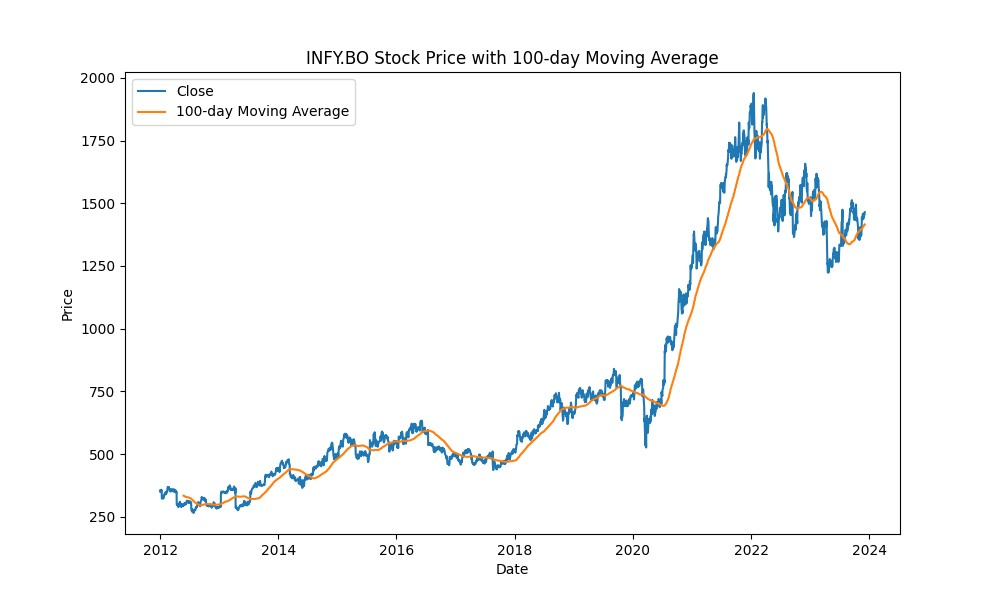
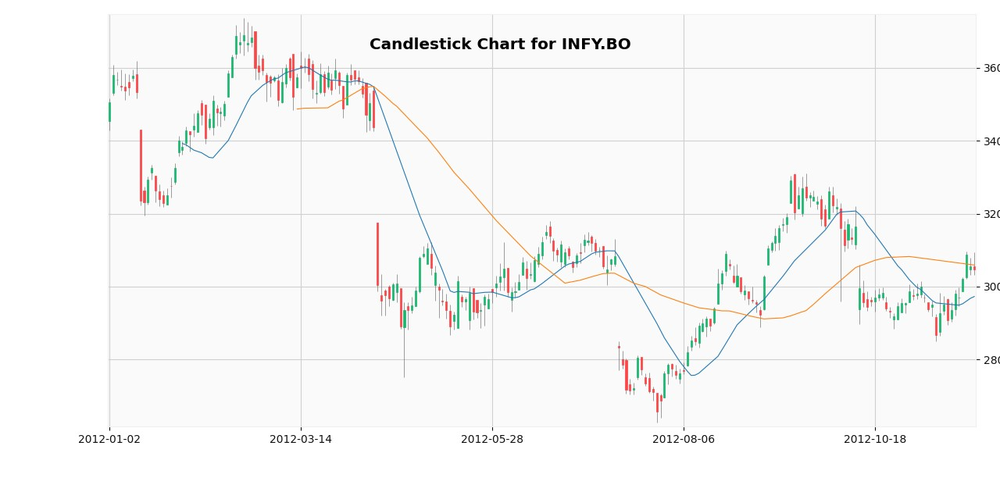

# Stock-Analysis-using-Python
An assortment of Python scripts leveraging yfinance for analyzing historical stock data from the Bombay Stock Exchange (BSE). Includes tools for visualization, price trend analysis, rolling averages, and machine learning-based future price prediction.

# Usage 
**Fetch Historical Data:** Run intro.py to input a stock symbol, start date, and end date for visualizing historical stock prices.

**Moving Averages:** Execute rolling.py to calculate moving averages over specified windows for trend analysis.

**Candlestick Charts:** Use candle.py to generate candlestick charts and visualize stock movements within specific date ranges.

**Price Prediction:** Utilize ml.py to predict stock prices for upcoming quarters based on historical data and machine learning models.

## Scripts Overview
**intro.py :** This script prompts users to input a stock symbol, start date, and end date to visualize historical stock prices within the specified date range.

**rolling.py :** The rolling.py script calculates the moving averages of stock prices over a specific window, enabling users to analyze trends effectively.

**candle.py :** candle.py fetches historical stock data and uses mplfinance to create candlestick charts, visually representing stock price movements and trends.

**ml.py :** The ml.py script leverages scikit-learn to predict future stock prices for the next quarters based on historical stock data.

# License
This project is licensed under the MIT License. See the LICENSE file for details.
